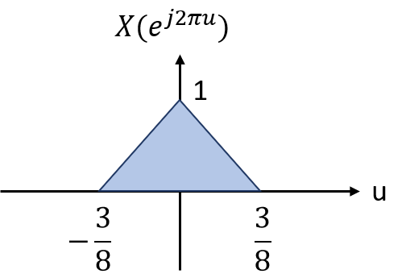
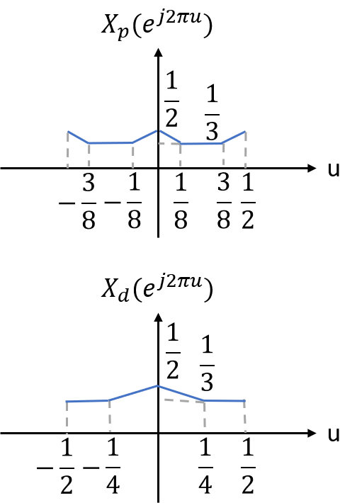

---
jupytext:
  formats: ipynb,md:myst
  text_representation:
    extension: .md
    format_name: myst
    format_version: 0.13
    jupytext_version: 1.11.5
kernelspec:
  display_name: Python 3
  language: python
  name: python3
---

+++ {"slideshow": {"slide_type": "subslide"}}

### Examples

+++ {"slideshow": {"slide_type": "subslide"}}

1\.The sequence $s[n] = (-1)^n$ is obtained by sampling the CT sinusoid $s(t) = \cos (2\pi f_0 t)$ at $1\,\mathrm{\mu s}$ interval, i.e., 

$$
  \cos(2\pi f_0 n T) = (-1)^n, T = 10^{-6} \,\mathrm{s}.
$$

Determine three distinct possible value of $f_0$

<!--\n
    Source: Signals and Systems, Alan V. Oppenheim
-->

Solution:

$\begin{align}
(-1)^n & = \exp(j n \pi) \\
& = \cos (n \pi)\\
& = \cos (n (2k+1) \pi), \quad k \in \mathbb{Z}\\
& = \cos(2\pi f_0 n T)\\
\Rightarrow f_0 & = \frac{2k+1}{2T}\\
& = \frac{2k+1}{2} \times 10^6 \,\mathrm{Hz}.
\end{align}$

+++ {"slideshow": {"slide_type": "subslide"}}

2\. Consider the system shown below. 
If $x(t) = x_1 * x_2(t)$, $X_1(f) = 0$ for $\lvert f \rvert > 2B$ and $X_2(f) = 0$ for  $\lvert f \rvert > B$, find the maximum value of $T, B_c$ and $A$ such that $r(t) = x (t).$

<!--\n
    Source: Signals and Systems, Alan V. Oppenheim
-->

Solution: 

$\begin{align}
X(f) & = X_1(f) X_2(f) \\
\Rightarrow X(f) &= 0, \quad \lvert f \rvert > B\\
\Rightarrow \frac{1}{T} &\geq 2B\\
T_{\mathrm{max}} & \leq \frac{1}{2B}\\
A_{\mathrm{max}} & = T,\\
B \leq &B_c \leq  \frac{1}{T} - B\\
\Rightarrow \max  & B_c =  B
\end{align}$

+++ {"slideshow": {"slide_type": "subslide"}}

3\. Consider a DT sequence $x[n]$ from which we form two new sequences, $x_p[n]$ and $x_d[n]$, where $x_p[n]$ corresponds to sampling $x[n]$ with sampling period 2 and $x_d[n]$ corresponds to decimating $x[n]$ by a factor of $2$, i.e., 

$\begin{align}
x_p[n] & = 
\begin{cases}
x[n], \quad \text{n is even,} \\
0, \quad \text{n is odd}, 
\end{cases}
\end{align}$

and 

$$
  x_d[n] = x[2n].
$$

If $X(e^{j 2\pi u})$ is as shown below, sketch $X_p(f)$ and $X_d(f)$.

Solution:

$\begin{align}
x_p[n] &= \frac{1}{2}(x[n] + (-1)^n x[n])\\
X_p(e^{j 2\pi u}) & = \frac{1}{2} (X(e^{j 2\pi u}) + X(e^{j 2\pi (u-\frac{1}{2})}))\\
X_d(e^{j 2\pi u}) & = \frac{1}{2} (X(e^{j \pi u}) + X(e^{j \pi (u-\frac{1}{2})})  )  
\end{align}$

 

+++ {"slideshow": {"slide_type": "subslide"}}

4\. Consider an upsampling system A, which inserts $(N-1)$ zero sequence values between each sequence value of $x[n]$, so that 

$\begin{align}
x_p[n] = 
\begin{cases}
x_d[n/N], \quad n = 0, \pm N, \pm 2N, ..., \\
0, \quad \text{otherwise}
\end{cases}
\end{align}$

Determine whether the system is linear and whether the system is time-invariant. 

Solution:

Linearity: consider $x_1[n]$, $x_2[n]$ and $x_3[n] = a x_1[n] + b x_2[n]$. Then

$\begin{align}
x_{1p}[n] & = 
\begin{cases}
x_1[n/N], \quad n = 0, \pm N, \pm 2N, ..., \\
0, \quad \text{otherwise}
\end{cases}\\
x_{2p}[n] & = 
\begin{cases}
x_2[n/N], \quad n = 0, \pm N, \pm 2N, ..., \\
0, \quad \text{otherwise}
\end{cases}\\
x_{3p}[n] & = 
\begin{cases}
x_3[n/N], \quad n = 0, \pm N, \pm 2N, ..., \\
0, \quad \text{otherwise}
\end{cases}\\
& = 
\begin{cases}
a x_1[n/N] + b x_2 [n/N], \quad n = 0, \pm N, \pm 2N, ..., \\
0, \quad \text{otherwise}
\end{cases}\\
& = a x_{1p}[n] + b x_{2p}[n].
\end{align}$

Therefore, the system is linear. 

Time-invariance: consider the case where $N= 2$ and $x_1[n]$ and $x_2[n] = x_1[n-1]$ as shown below. 
Since $x_{1p}[n-1] \neq x_{2p}[n]$, the system is not time-invariant. 

+++ {"slideshow": {"slide_type": "subslide"}}

5\. Suppose rounding-off rule for uniform quantization. If we have 8 samples of a analog signal and the quantization error $q_e$ are found to be distributed as 
$$
  q_e = [-0.148, 
   0.330, 
   0.085, 
   0.049,  
   0.417, 
  -0.214, 
   0.257, 
   0.253 ].
$$

Decide a possible value of quantization step size $\Delta$. 

Solution: 

Quantization error $q_e \in [-\frac{\Delta}{2},\frac{\Delta}{2}]$. Thus,  $\Delta$ could be $0.5$.

+++ {"slideshow": {"slide_type": "subslide"}}

6\. The input $x[n]$ to the system

$$
  y[n] = 0.999 y[n-1] + x[n]
$$

is quantized to $b = 8\,\mathrm{bits}$. What is the power produced by the quantization noise at the output?

<!--\n
    Source: Digital signal processing, 4th edition, John G. Proakis
-->

Solution:

For quantization noise $e[n] \in [-\frac{1}{2^9}, \frac{1}{2^9}]$, 

$\begin{align}
y[n] & = 0.999 y[n-1] + e[n], \\
\mathbb{E}[y[n]^2] & = 0.999^2 \mathbb{E}[y[n-1]^2] + \mathbb{E}[e[n]^2] \\
(1-0.999^2) \mathbb{E}[y[n]^2] & = \mathbb{E}[e[n]^2], \quad \text{by } \mathbb{E}[y[n]^2] = \mathbb{E}[y[n-1]^2]\\
 \mathbb{E}[y[n]^2] & = \frac{\Delta^2}{12} \cdot \frac{1}{1-0.999^2}, \quad \text{by } \mathbb{E}[e[n]^2] =  \frac{\Delta^2}{12}\\
 & = 0.000636 \,\mathrm{W},\quad \text{by } \Delta = \frac{1}{2^8}.
\end{align}$