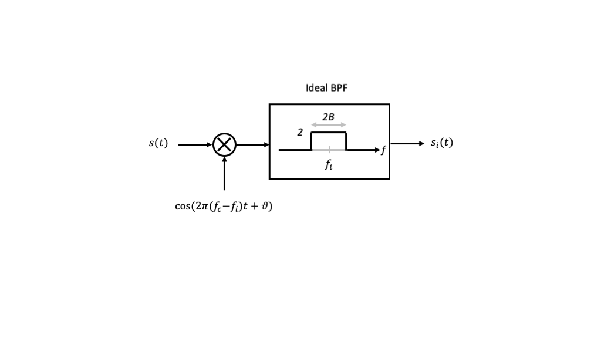
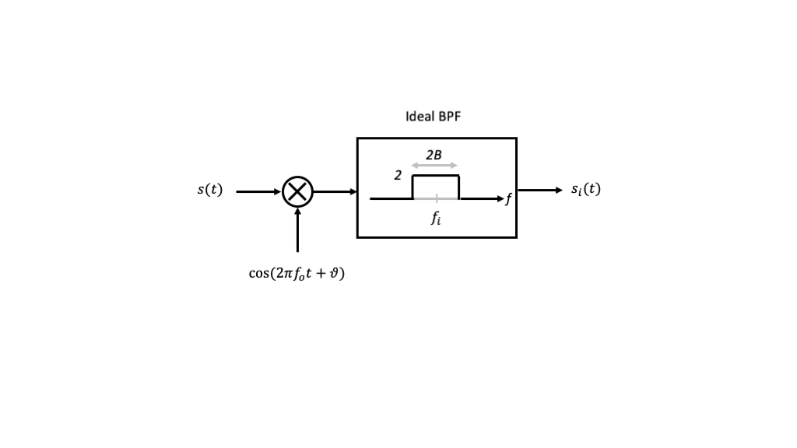
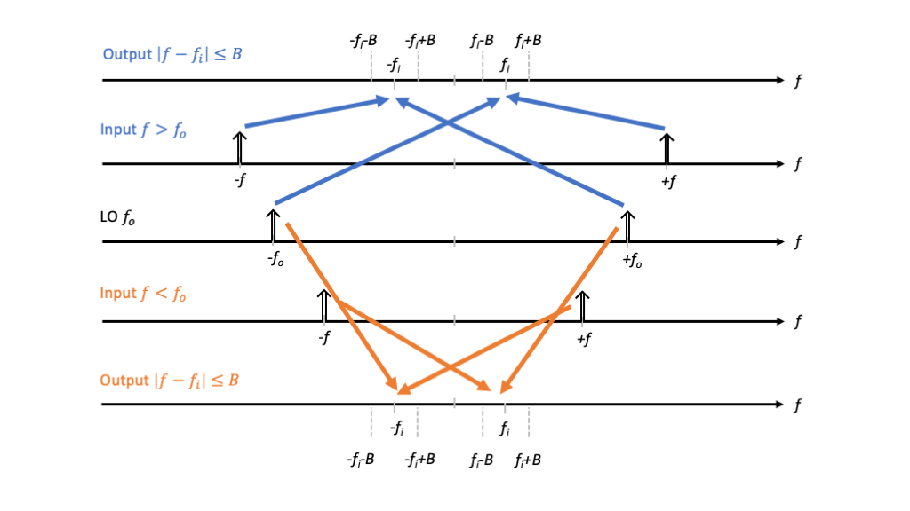
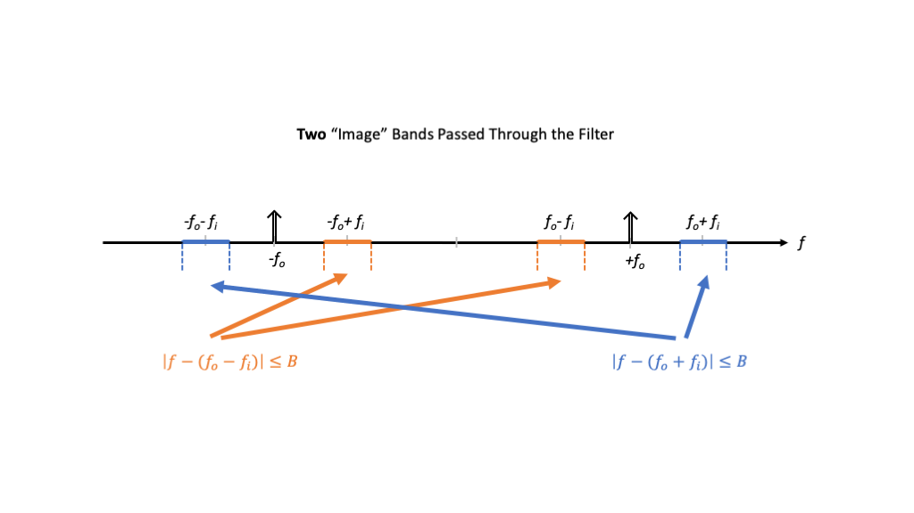
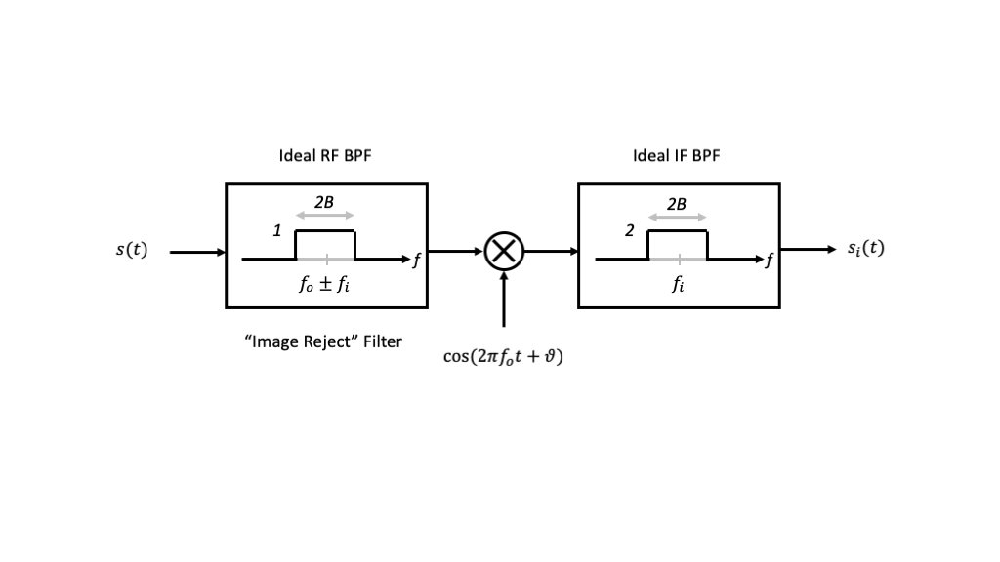

---
jupytext:
  formats: ipynb,md:myst
  text_representation:
    extension: .md
    format_name: myst
    format_version: 0.13
    jupytext_version: 1.11.5
kernelspec:
  display_name: Python 3
  language: python
  name: python3
---

+++ {"colab_type": "text", "id": "z7wtzH2Lszxp", "slideshow": {"slide_type": "slide"}}

# Lecture 15: Image Rejection

+++ {"colab_type": "text", "id": "z7wtzH2Lszxp", "slideshow": {"slide_type": "slide"}}

## Summary

In this lecture, we will introduce and address the so-called "image problem" that arises when we convert between carrier and intermediate frequency signals.

+++ {"slideshow": {"slide_type": "slide"}}

## Motivation in Course Context

In our last lecture, we developed the first stage of a heterodyne receiver as shown in the figure below.

We developed the mathematics to show that if $s(t)$ is a passband signal centered at the carrier frequency $f_c > f_i+B$, the multiplication creates two components centered at the sum $2f_c - f_i$ and difference $f_i$ frequencies. The bandpass filter eliminates the former and passes the latter, so that the output is a passband signal centered at $f_i$.

In this lecture, we will observe that **other** frequency components at the input can be downconverted into the intermediate frequency band centered at $f_i$, and we develop remedies to address this problem.

+++ {"slideshow": {"slide_type": "slide"}}

## Outline

* The Image Problem

* Image Rejection Filtering

+++

## The Image Problem

Consider the signal $s(t)=\cos(2\pi f  t)$, where we will treat $f$ as variable, applied to the input of the first stage of the downconversion mixer shown in the figure below.

From our prior development with trigonometric identities, we know that the input to the filter will be the sum and difference signals

$$
  s(t)\cos(2\pi f_o t + \vartheta) = \frac{1}{2}\left[\cos(2\pi (f_o+f) t + \vartheta) + \cos(2\pi (f_o-f) t + \vartheta)\right]
$$

+++

The figure below shows how the convolutions in the frequency domain can create frequency components in the positive frequency interval $[f_i-B,f_i+B]$ and negative frequency interval $[-f_i-B,-f_i+B]$.

+++

Specifically, for the case $f > f_o$ (blue), we find that the bandpass filter passes any frequency satisfying

$$
  f_i - B < f-f_o < f_i+B
$$

or $|f-(f_o+f_i)| < B$, which is the passband centered at $f_o + f_i$ of  bandwidth $2B$.

+++

Similary , for the case $f < f_o$ (orange), we find that the bandpass filter passes any frequency satisfying

$$
  f_i -B < f_o - f < f_i+B
$$

or $|f-(f_o-f_i)| < B$, which is the passband centered at $f_o-f_i$ of bandwidth $2B$.

+++

These frequency bands are called the two *image* bands for the fixed mixer and IF bandpass filter, and are illustrated in the figure below.

+++

Given the above analysis, we observe that if our desired transmit signal's frequency content is one of the heterodyne downconverter's image bands, e.g., centered at $f_o+f_i$, then the receiver will be susceptible to interference in the other frequency band, e.g., $f_o - f_i$.

+++

## Image Rejection Filtering

To reduce the impact of undesired images, we can add another bandpass filter at the input to the mixer. This additional filter is called an *image reject* filter.

+++

This updated "ideal" downconverter architecture is shown in the figure below.

+++

For clarity, the image reject filter selects **either** the image centered at $f_o+f_i$ or $f_o-f_i$, and is intended to reject the other.

+++

The bandpass filters above are shown to have their passband including just the desired signal's passband, and completely rejecting everything else. In practice, neither bandpass filter can be ideal, but will have a finite transition band and limited stopbband attenuation.

+++

The figure below illustrates constraints on the RF bandpass filter if we intend to select inputs centered at $f_o+f_i$ and reject inputs centered at $f_o - f_i$.

In particular, we want the image reject filter to have significant attenuation at the frequency $f_o-f_i + B$. If $B$ and $f_o$ are fixed, then we can relax the complexity and cost of the bandpass filter by selecting the intermediate frequency $f_i$ as large as possible.

+++

However, there may be practical constraints on the intermediate frequency as well. For example, we require $f_i > B$ to ensure the first stage of modulation to the intermediate frequency does not have overlap in the frequency domain. There may also be an upper limit on the intermediate frequency imposed by the capabilities of the first mixing stage. The following example illustrates this point.

+++

**Example:** Very often an intermediate frequency signal is generated in the transmitter and processed in the receiver using DT processing. If the minimum bandwidth of the DAC and ADC is denoted by $W\ \mathrm{Hz}$ and we use NRZ signaling with bit rate and mainlobe bandwidth $R=1/T$, then what is the largest possible IF frequency that should be allowed?

Answer: $f_i < W - 1/T$. In fact, to ensure $K-1$ sidelobes around the mainlobe, we would require $f_i < W - K/T$.

+++

## Image Rejection Mixing

Just as we saw that we could employ the Hilbert Transform and single sideband techniques to eliminate one sideband in homodyne upconversions, similar ideas can be applied to reject the undesired image in heterodyne downconversion. However, this approach requires Hilbert Transforms (implemented as $\pi/2$ "hybrids") and an additional mixer.

**TBD: Expanded treatment**
