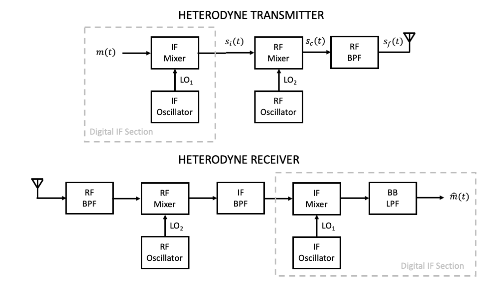
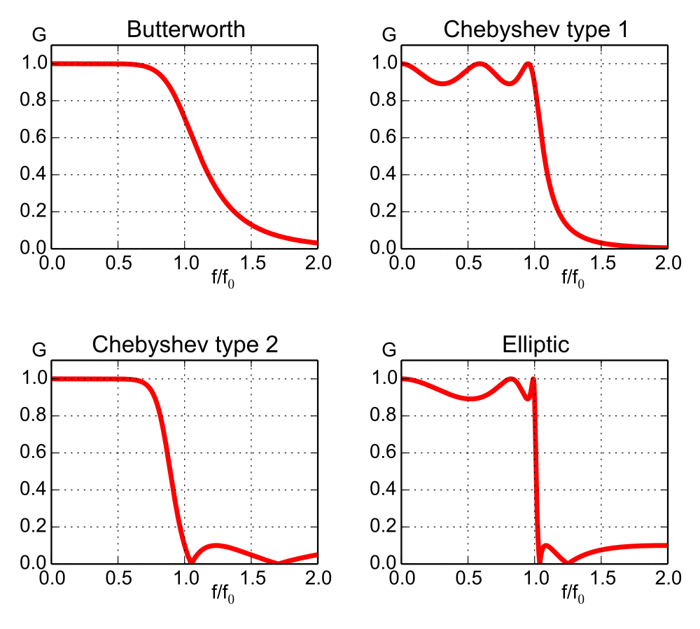

---
jupytext:
  formats: ipynb,md:myst
  text_representation:
    extension: .md
    format_name: myst
    format_version: 0.13
    jupytext_version: 1.11.5
kernelspec:
  display_name: Python 3
  language: python
  name: python3
---

+++ {"colab_type": "text", "id": "z7wtzH2Lszxp", "slideshow": {"slide_type": "slide"}}

# Lecture 16: Heterodyne Design Tradeoffs

+++ {"colab_type": "text", "id": "z7wtzH2Lszxp", "slideshow": {"slide_type": "slide"}}

## Summary

In this lecture, we will put all the pieces together and experiment numerically with various design tradeoffs for heterodyne transmitter and receiver design.

+++ {"slideshow": {"slide_type": "slide"}}

## Outline

* System Block Diagram

* Numerical Explorations

+++

## System Block Diagram



+++

### Key Parameters

* Bit / symbol rate $R$

* $9x\%$-bandwidth $B$ of the baseband signal $m(t)$

* Largest IF frequency $f_i$ that can be handled by the first stage of upconversion and last stage of downconversion, especially limited sampling frequency and / or bandwidth of the DACs and ADCs

* Passbands, transition bands, and stopband attenuations of the RF and IF bandpass filters as well as BB lowpass filter.

### Filter Design

To model the tradeoffs associated with practical filters, it makes sense to focus on one or two classes of filter designs. The most common filter classes include Butterworth, Chebyshev Types 1 and 2, and Elliptical filters. These filter types are illustrated in the figure below, for the case of lowpass filters of order five.


(Image from: https://en.wikipedia.org/wiki/Butterworth_filter)

Based upon the above examples, we recommend use of the Butterworth or Chebyshev Type 2 filters. The Butterworth filters are maximally in the passband and exhibit no ripple in the stopband. Chebyshev Type 2 have a narrower transition band but exhibit ripple in the stopband.

Note: The Python package SciPy has filter design and filtering routines for Butterworth, Chebyshev, and Elliptical filters.

https://docs.scipy.org/doc/scipy-0.14.0/reference/signal.html

+++

## Numerical Explorations

```{code-cell} ipython3
# Allows interactive plots inside Jupyter Notebooks!!

%matplotlib notebook
import matplotlib.pyplot as plt
import numpy as np
from scipy.signal import upfirdn, butter, cheby2, lfilter, hilbert
```

System parameters

```{code-cell} ipython3
fc = 2.4e9 # target carrier frequency
fi = 15e6 # intermediate frequency
R = 2e6 # symbol / bit rate
B = 5*R # effective bandwidth of NRZ signaling
fs = 2*(2*fc+fi+B) # Nyquist rate considering downconverstion mixing
M=fs/R # oversampling factor
```

Randomly generated packet of bits

```{code-cell} ipython3
N=1000 # packet length in bits
bits=np.random.randint(0,2,N)
```

Sample index range

```{code-cell} ipython3
n=np.arange(0,N*M)
```

DT NRZ signaling

```{code-cell} ipython3
msg=upfirdn(np.ones(int(M)),bits,M,1) # rectangular pulse shaping
```

DSB-SC IF modulation

```{code-cell} ipython3
si=msg*np.cos(2*np.pi*(fi/fs)*n) # if mixing
```

Spectrum Plot of BB and IF

```{code-cell} ipython3
K=2**18
Msg = np.square(np.abs(np.fft.fft(msg,K)))
Si = np.square(np.abs(np.fft.fft(si,K)))
plt.plot(np.arange(-fs/2,fs/2,fs/K),10*np.log10(np.fft.fftshift(Msg)),'-',label="TX Baseband Message")
plt.plot(np.arange(-fs/2,fs/2,fs/K),10*np.log10(np.fft.fftshift(Si)),'-',label="TX IF Mixer Output")
plt.grid()
plt.ylabel("Magnitude Squared (dB)")
plt.xlabel("Frequency (Hz)")
plt.legend()
plt.show()
```

Heterodyne Mixing

```{code-cell} ipython3
sc=si*np.cos(2*np.pi*((fc-fi)/fs)*n) # subheterodyne carrier mixing
```

Image Reject Filtering

```{code-cell} ipython3
# Note: Butterworth filter frequency normalizations are relative to Nyquist, i.e., fs/2
numc, denc = butter(4,[(fc-B)/(fs/2),(fc+B)/(fs/2)],'bandpass',output='ba')
sf = 2*lfilter(numc,denc,sc)
```

Spectrum Plot of at RF

```{code-cell} ipython3
K=2**18
Sc = np.square(np.abs(np.fft.fft(sc,K)))
Sf = np.square(np.abs(np.fft.fft(sf,K)))
plt.plot(np.arange(-fs/2,fs/2,fs/K),10*np.log10(np.fft.fftshift(Sc)),'-',label="TX RF Mixer Output")
plt.plot(np.arange(-fs/2,fs/2,fs/K),10*np.log10(np.fft.fftshift(Sf)),'-',label="TX RF Filtered Output")
plt.grid()
plt.ylabel("Magnitude Squared (dB)")
plt.xlabel("Frequency (Hz)")
plt.legend()
plt.show()
```

RF to IF Downconversion

```{code-cell} ipython3
sfh = sf
sih = sfh*np.cos(2*np.pi*((fc-fi)/fs)*n)
# Note: Butterworth filter frequency normalizations are relative to Nyquist, i.e., fs/2
numi, deni = butter(2,(fi+B)/(fs/2),'lowpass',output='ba')
sihf = 2*lfilter(numi,deni,sih)
```

Rx IF Spectrum Plot

```{code-cell} ipython3
K=2**18
Sih = np.square(np.abs(np.fft.fft(sih,K)))
Sihf = np.square(np.abs(np.fft.fft(sihf,K)))
plt.plot(np.arange(-fs/2,fs/2,fs/K),10*np.log10(np.fft.fftshift(Sih)),'-',label="RX IF Mixer Output")
plt.plot(np.arange(-fs/2,fs/2,fs/K),10*np.log10(np.fft.fftshift(Sihf)),'-',label="RX IF Filtered Output")
plt.grid()
plt.ylabel("Magnitude Squared (dB)")
plt.xlabel("Frequency (Hz)")
plt.legend()
plt.show()
```

IF to BB Downconversion

```{code-cell} ipython3
sbh = sihf*np.cos(2*np.pi*(fi/fs)*n)
# Note: Butterworth filter frequency normalizations are relative to Nyquist, i.e., fs/2
numb, denb = butter(4,B/(fs/2),'lowpass',output='ba')
msgh = 2*lfilter(numb,denb,sbh)
```

Comparison Spectrum Plot

```{code-cell} ipython3
K=2**18
Msg = np.square(np.abs(np.fft.fft(msg,K)))
Msgh = np.square(np.abs(np.fft.fft(msgh,K)))
plt.plot(np.arange(-fs/2,fs/2,fs/K),10*np.log10(np.fft.fftshift(Msg)),'-',label="Tx Message")
plt.plot(np.arange(-fs/2,fs/2,fs/K),10*np.log10(np.fft.fftshift(Msgh)),'-',label="Rx Mesage")
plt.grid()
plt.ylabel("Magnitude Squared (dB)")
plt.xlabel("Frequency (Hz)")
plt.legend()
plt.show()
```

Comparison Time Domain Plot

```{code-cell} ipython3
plt.plot(n,msg,'-.',label='TX Message')
plt.plot(n,msgh,'-',label='RX Message')
plt.legend()
plt.grid()
plt.show()
```

## Caveat

The numerical explorations in this lecture have treated the mixers as ideal, ignoring possible leakage and self-mixing issues. These should be explored futher for a complete design.
